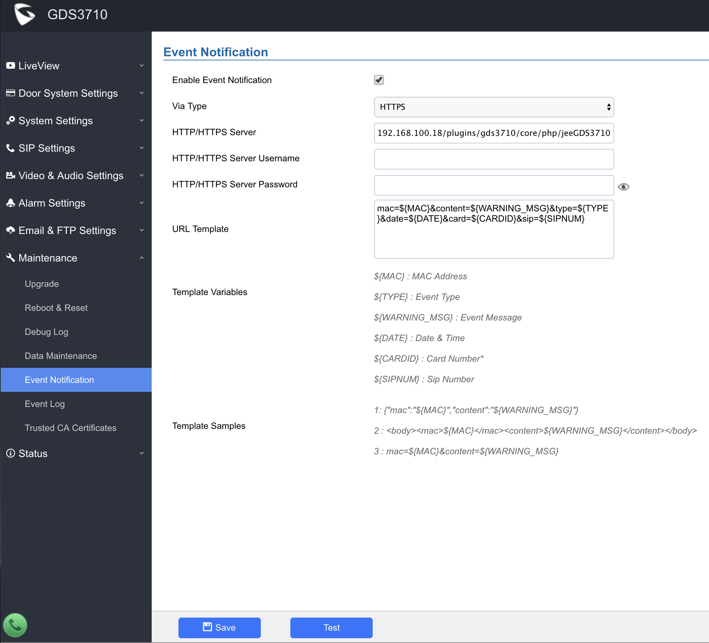

# Plugin GDS 3710
> by Richard Perez | richard@perez-mail.fr

## 1) Introduction

Ce plugin permet l'Intégration du portier GrandStream GDS3710 dans Jeedom. Dans sa version actuelle, il permet de récupérer dans Jeedom les évènements du portier dans Jeedom et de les via des scénariis ou des commandes.

## 2) Configuration du portier GrandStream GDS3710
### a) Pré-requis
Afin de récupérer les évènements générés par le portier nous allons utiliser la foncitonnalité "Event Notification" qui est disponible à partir de la version 10.0.3.32 du firmware du GrandStream GDS3710. Si vous disposez d'une version antérieure la fonctionnalité "Event notification" ne sera peut-être pas disponible et il vous faudra mettre à jour le firmware de votre GDS3710 vers la dernière version.
### b) Configuration de la fonctionnalité "Event Notification"
- Rendez-vous dans l'interface de gestion de votre GDS3710 puis dans Maintenance -> Event Notification
- Cochez la case "Enable Event Notification"
- Sélectionnez le type de communication avec le serveur "Http" ou "Https" selon la configuration de votre serveur Jeedom.
- Optionnel mais fortement recommandé : Saisissez un identifiant et un mot de passe que votre portier devra fournir a Jeedom pour publier un évènement.
- Dans champs "HTTP/HTTPS Server", entrez la chaine suivante en remplacant IP_DE_VOTRE_JEEDOM par l'adresse IP de votre serveur Jeedom : `"IP_DE_VOTRE_JEEDOM/plugins/gds3710/core/php/jeeGDS3710.php"`
- Dans le champs URL Template, entrez la chaine suivante : `mac=${MAC}&content=${WARNING_MSG}&type=${TYPE}&date=${DATE}&card=${CARDID}&sip=${SIPNUM}`
- Sauvegarder la configuration.

### c) Activation de l'API Http pour l'ouverture de la porte
- Rendez-vous dans l'interface de gestion de votre GDS3710 puis dans Door System Settings -> Basic Settings.
- Cochez la case "Enable HTTP API Remote Open Door"
- Choisissez un PIN pour l'option "Remote PIN to Open Door"
- Sauvegardez la configuration

NB : Assurez-vous d'avoir changer le mot-de-passe par défaut du compte admin avant d'activer cette fonctionnalité.

### d) Relevé de l'adresse IP et de l'adresse Mac de votre portier
- Rendez-vous dans l'interface de gestion de votre GDS3710 puis dans Status -> Network info
- Relevez l'adresse Mac et l'adresse IP de votre portier, nous en aurons besoin plus tard.

### f) Configuration du plugin
- Allez à la page de configuration du plugin et saisissez l'identifiant et le mot-de-passe que vous avez choisis à l'étape 2 - b.

### f) Configuration de votre équipement
- Une fois le plugins installé, créez un nouvel équipement "GDS3710", activez le.
- Entrez l'adresse MAC (sans les ":") de votre portier dans le champs correspondant.
- Entrez l'Adresse IP de votre portier dans le champs correspondant.
- Saisissez le mot-de-passe du compte admin dans le champs correspondant.
- Saisissez le Remote PIN dans le champs correspondant.
- Sauvegardez les modifications apportées à l'équipement.

**C'est terminé, tout est configuré.**

## 3) Utilisation
### a) Principe de fonctionnement
Chaque évènement envoyé par le GDS3710 comporte un type dont voici la liste (extrait de la documentation du GDS3710 sur la fonctionnalité "event notification", disponible ici : http://www.grandstream.com/sites/default/files/Resources/gds_event_logs_guide.pdf):

| Type d'évènement | Nom | Description de l'évènement|
| ------------ | ------------ |------------ |
|100 |Open Door via Card|Indicates that someone opens the door via card or key fob.|
| 101  |  Open Door via Card (over Wiegand) | Indicates that someone opens the door via card or key fob using Wiegand interface connected to GDS.|
| 200  | Visiting Log  | Indicates that door has been opened for visitor which pressed door bell button.|
|300|Open Door via Universal PIN |Indicates that door has been opened successfully using local PIN code via GDS keypad.|
|301 |Open Door via Private PIN |Indicates that someone opened the door successfully using their private PIN code via GDS keypad.|
|302 |Open Door via Guest PIN |Indicates that a guest used “Guest PIN” code to open the door using GDS keypad.|
|400 |Open Door via DI |Indicates that door has been opened using DI (Digital Input) Signal, such as using a push button.|
|500 |Call Out Log |Indicates the GDS unit initiated a call out, for example when someone uses the keypad to dial a number or press door bell button which preconfigured destination number.|
|501 |Call In Log |Indicates that call has been received by the GDS unit.|
|504 |Call Log (Door Bell Call) |Indicates that someone has initiated a call using door bell button.|
|600 |Open Door via Card and PIN |Indicates that someone used his RFID card or key fob, plus his own private password to authenticate and open the door.|
|601 |Keep Door Open (Immediately)|Key door Open (immediately) action has been performed from the web Interface.|
|602 |Keep Door Open (Scheduled)|Key door Open (immediately) action has been set from the web Interface and the event is triggered.|
|700 |Open Door via Remote PIN |Indicates that someone did send remote PIN code to open the door using GDS manager tool for example.|
|800 |HTTP API Open Door |Indicates that someone did send remote PIN code to open the door HTTP API command.|
|900 |Motion Detection |Indicates that motion detection is triggered.|
|1000 |DI Alarm |Indicates that alarm IN is triggered.|
|1100 |Dismantle by Force |Indicates that the unit has been dismantled by force.|
|1101 |System up |Indicates that the system is UP|
|1102 |Reboot |Indicates that the GDS unit has been rebooted.|
|1103 |Reset (Clear All Data) |Factory reset (clear all data) has been performed.|
|1104 |Reset (Retain Network Data Only) |Factory reset (Retain Network Data Only) has been performed.|
|1105|Reset (Retain Only Card Information)|Factory reset (Retain Only Card Information) has been performed.|
|1106|Reset (Retain Network Data and Card Information) |Factory reset (Retain Network Data and Card Information) has been performed.|
|1107 |Reset (Wiegand) |Factory reset using Wiegand module has been performed on the unit.
|1108 |Config Update |Indicates that the system’s configuration has been updated.
|1109 |Firmware Update (1.0.0.0)|Indicates that the system’s firmware has been upgraded.|
|1200 |Hostage Alarm |Indicates that someone has entered the hostage alarm PIN code to open the door.|
|1300 |Invalid Password |Indicates that someone has entered wrong password PIN code to open the door for 5 attempts and corresponding alarm action has been triggered.|
|1400|Mainboard Temperature(32°C) Normal |Indicates that device’s mainboard temperature is normal, (around 32°C).|
|1401|Mainboard Temperature(32°C) Too Low |Indicates that device’s mainboard temperature is too low.|
|1402|Mainboard Temperature(32°C) Too high |Indicates that device’s mainboard temperature is too high.|
|1403 |Sensor Temperature(32°C) Normal |Indicates that device's sensor temperature is normal, (around 32°C).•
|1404 |Sensor Temperature(32°C) Too Low |Indicates that device's sensor temperature is normal too low.|
|1405 |Sensor Temperature(32°C) Too High |Indicates that device's sensor temperature is normal too high.|

### b) Utilisation avec des commandes d'actions

Pour chaque code d'évènement vous avez la possibilité dans les onglets "Appel", "Ouverture Porte", "Maintient de l'ouverture", "Sécurité", "Surveillance Matériel" et "Surveillance Logiciel" de créer une liste de commandes qui seront exécutées lors de la réception de ces évènements. Utilisez simplement le bouton "Ajouter une action", présent à coté de chaque type d'évènement puis sélectionner l'action à réaliser. Une fois les actions ajoutées, vous avez la possibilité de changer l'ordre d'éxécution en les faisant glisser.

### c) Utilisation avec des scénarii

L'ajout d'un scénario en réponse à un évènement reçu se fait en saisissant "scenario" dans le champs "action" après avoir cliqué sur le bouton "Ajouter une action". Une nouvelle boite de dialogue vous permettra alors de sélectionner le scénario à exécuter.

Lors de l'exécution du scénario, les informations reçues par jeedom seront transmises au scénario par les biais des Tags suivant :

|Tag|Contenu|
|-------|--------|
|#mac#|Contient l'adresse Mac de l'appareil ayant envoyé la notification|
|#content# |Contient un message de description de la notification envoyé par le GDS3710|
|#type#|Contient le type de la notification|
|#date#|Contient l'heure et la date de la notification|
|#sip#|Contient le numéro SIP relatif à la notification|
|#card#|Contient le numéro de la carte relatif à la notification|

###  d) Utilisation de l'onglet commandes

L'onglet commande contient des commandes de type info contenant pour chaque type d'évènement le dernier évènement reçue au format JSON. La commande "Last event" contient la dernier évèneement réceptionné.

###  e) Ouverture et fermeture de la porte
