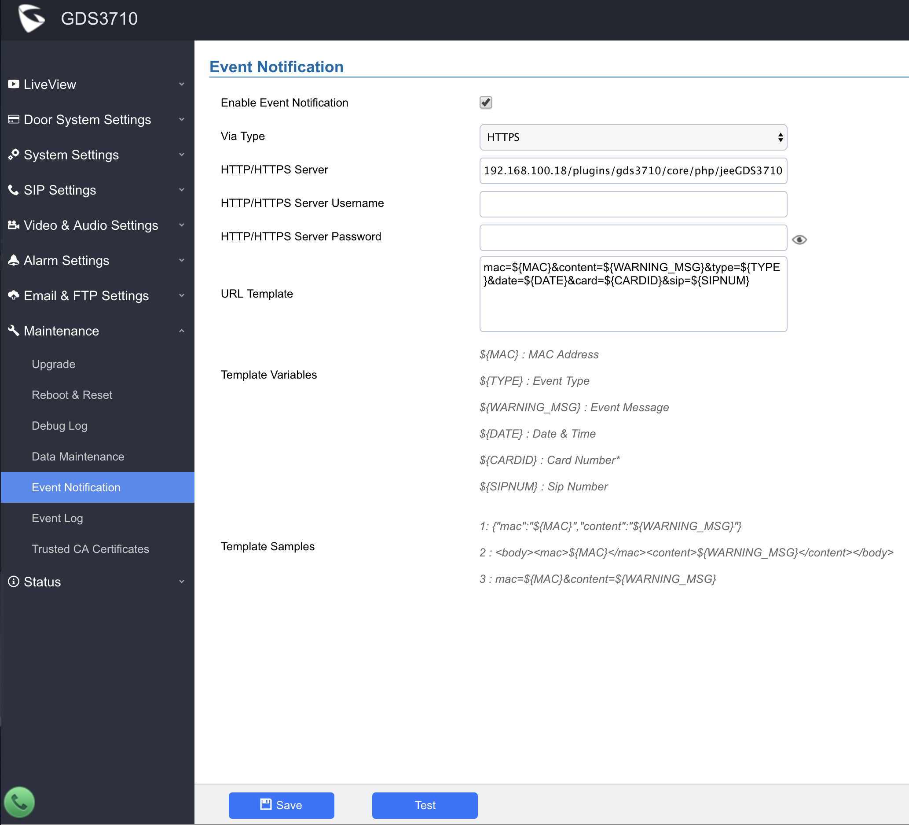
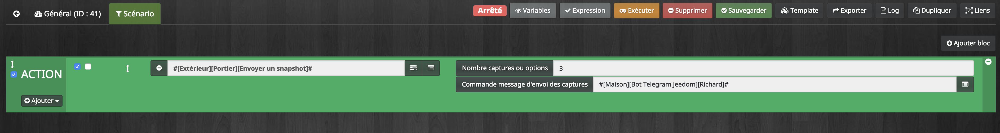

# Plugin GDS 3710
> by Richard Perez | richard@perez-mail.fr

# Compatibilité

| | |
|---|---|
| Jeedom | 4.4 et supérieur (PHP 8) |
| Firmware du portier | testé jusqu'à la version 1.0.13.15 (juillet 2025) |
| Firmware minimum conseillé | 1.0.11.18 |

Deux points de compatibilité liés au firmware du portier :

- **En dessous de 1.0.11.18**, la notification d'évènements envoyait un `Content-Type` incorrect avec les gabarits fournis par le portier, ce que PHP ne sait pas décoder. Le plugin sait désormais rattraper ce cas, mais la mise à jour du firmware reste conseillée.
- **Si l'accès web du portier est configuré en HTTPS**, le firmware 1.0.13.2 ou supérieur est nécessaire : avant cette version, l'API HTTP ne répondait pas dans ce mode.

# Introduction
Ce plugin permet l'intégration du portier GrandStream GDS3710 dans Jeedom. Il permet de :
- Récupérer les évènements du portier et de les gérer via des scénarios ou des commandes.
- De modifier la configuration du portier.
- D'activer les contacts secs du portier permettant de manoeuvrer une porte ou autre.
- D'afficher le flux MJPEG du portier dans un widget de dashboard ou de mobile.
- D'enregistrer des images extraites du flux MJPEG.
- De consulter les images enregistrées via une bibliothèque intégrée.
- D'envoyer des images enregistrées via une autre commmande (testé avec le plugin Telegram).
- D'activer ou de désactiver le LDC (Lens Deformation Correction).
- De changer le réglage du capteur vidéo du portier (normal, low-light et WDR)
- De configurer le portier lui-même en une commande, sans saisie manuelle.
- De remonter les capteurs du portier : entrées et sorties digitales, état des relais, anti-arrachement, températures, uptime, version de firmware et disponibilité d'une mise à jour.
- De purger automatiquement les captures au-delà d'une durée de conservation.
- D'exploiter les évènements décomposés en commandes : code, libellé, date, badge, utilisateur, porte, numéro SIP, dernière personne entrée et dernière alerte sécurité.
- De piloter les réglages du portier : luminosité de la LED du clavier, luminosité, contraste et saturation de l'image, délai avant capture, raccrochage après ouverture, et le planning du rétroéclairage blanc.
- (Beta) D'enregistrer un client SIP directement depuis Jeedom et de répondre aux appels directement sur le dashboard.

Ce plugin est basé sur la document fourni par GrandStream : http://www.grandstream.com/sites/default/files/Resources/gds37xx_http_api.pdf

# Configuration du portier GrandStream GDS3710

> **Le plus simple : la commande « Configurer le portier ».** Une fois l'équipement créé avec son adresse IP et son mot de passe, cette commande écrit elle-même sur l'appareil l'activation de la notification, l'adresse de ce Jeedom, le gabarit d'URL complet, la méthode et les identifiants — puis relit tout pour confirmer. La saisie manuelle décrite ci-dessous reste documentée, mais c'est la première cause de panne du plugin.
>
> Le plugin vérifie ensuite toutes les 15 minutes que le portier pointe toujours vers ce Jeedom, et prévient au centre de messages si ce n'est plus le cas.

## Pré-requis
Afin de récupérer les évènements générés par le portier nous allons utiliser la foncitonnalité "Event Notification" qui est disponible à partir de la version 10.0.3.32 du firmware du GrandStream GDS3710. Si vous disposez d'une version antérieure la fonctionnalité "Event notification" ne sera peut-être pas disponible et il vous faudra mettre à jour le firmware de votre GDS3710 vers la dernière version.

## Configuration de la fonctionnalité "Event Notification"
- Rendez-vous dans l'interface de gestion de votre GDS3710 puis dans Maintenance -> Event Notification.
- Cochez la case "Enable Event Notification".
- Sélectionnez le type de communication avec le serveur "http" ou "https" selon la configuration de votre serveur Jeedom.
- Optionnel mais fortement recommandé : Saisissez un identifiant et un mot de passe que votre portier devra fournir a Jeedom pour publier un évènement.
- Dans champs "HTTP/HTTPS Server", entrez la chaine suivante en remplacant IP_DE_VOTRE_JEEDOM par l'adresse IP de votre serveur Jeedom : `"IP_DE_VOTRE_JEEDOM/plugins/gds3710/core/php/jeeGDS3710.php"`.
- Dans le champs URL Template, entrez la chaine suivante : `mac=${MAC}&content=${WARNING_MSG}&type=${TYPE}&date=${DATE}&card=${CARDID}&sip=${SIPNUM}&username=${USERNAME}&doornum=${DOOR_NUM}`.

> Les deux dernières variables (`USERNAME` et `DOOR_NUM`) étaient absentes des versions précédentes de cette documentation alors que le plugin les exploite : sans elles, le nom de la personne et le numéro de porte ne remontent pas dans les tags de scénario.

- La méthode HTTP peut être réglée sur POST ou sur GET selon le firmware : le plugin accepte les deux.
- Sauvegarder la configuration.

## Configuration de l'authentification pour le flux MJPEG
- Rendez-vous dans l'interface de gestion de votre GDS3710 puis dans System Settings -> Access Settings.
- Sélectionnez le mode d'authentification du flux MJPEG (MJPEG Authentication Mode). Nous vous conseillons le mode "Challenge+Response" pour plus de sécurité.

## Activation de l'API HTTP pour l'ouverture de la porte
- Rendez-vous dans l'interface de gestion de votre GDS3710 puis dans Door System Settings -> Basic Settings.
- Cochez la case "Enable HTTP API Remote Open Door".
- Choisissez un PIN pour l'option "Remote PIN to Open Door".
- Sauvegardez la configuration.

NB : Assurez-vous d'avoir changer le mot-de-passe par défaut du compte admin avant d'activer cette fonctionnalité.

## Relevez de l'adresse IP et de l'adresse Mac de votre portier
- Rendez-vous dans l'interface de gestion de votre GDS3710 puis dans Status -> Network info.
- Relevez l'adresse Mac et l'adresse IP de votre portier, nous en aurons besoin plus tard.

# Sécurité

Deux protections encadrent la remontée d'évènements :

- **Contrôle de l'adresse d'origine** (actif par défaut, sans configuration). Un évènement n'est accepté que s'il provient de l'adresse IP renseignée pour l'équipement. L'adresse MAC du portier sert d'identifiant, pas de secret : elle est lisible sur l'appareil. Si votre Jeedom est derrière un NAT ou un proxy qui masque l'adresse réelle du portier, désactivez ce contrôle dans la configuration du plugin.
- **Protection par mot de passe** (activée par défaut sur les nouvelles installations). Elle est vivement conseillée dès lors que des évènements du portier déclenchent des actions sensibles. Sur une installation existante, le réglage n'est pas modifié par la mise à jour : pensez à l'activer.

Les captures et le flux vidéo ne sont accessibles qu'à un utilisateur connecté à Jeedom, ou avec une clef API valide.

# Configuration du plugin GDS3710 dans Jeedom
## Configuration générale
- Allez à la page de configuration du plugin et saisissez l'identifiant et le mot-de-passe que vous avez choisis à l'étape "Configuration de la fonctionnalité 'Event Notification'".
- Renseignez un répertoire pour le stockage des captures d'écran. Par défaut ce répertoire est : "plugins/gds3710/data/records".

## Création et configuration de votre équipement
- Une fois le plugins installé, créez un nouvel équipement "GDS3710" et activez le.
- Entrez l'adresse MAC (sans les ":") de votre portier dans le champs correspondant.
- Entrez l'Adresse IP de votre portier dans le champs correspondant.
- Saisissez le mot-de-passe du compte admin dans le champs correspondant.
- Saisissez le remote PIN dans le champs correspondant (il s'agit du PIN permettant d'ouvrir la porte 1).
- Saisissez le remote PIN 2 dans le champs correspondant (il s'agit du PIN permettant d'ouvrir la porte 2).
- Sélectionnez le mode d'authentification du flux MJPEG que vous avez choisis précédement.
- Sauvegardez les modifications apportées à l'équipement.

## Configuration et test du client SIP
TODO

**C'est terminé, tout est configuré.**

# Utilisation
## Principe de fonctionnement
Chaque évènement envoyé par le GDS3710 comporte un type dont voici la liste (extrait de la documentation du GDS3710 sur la fonctionnalité "event notification", disponible ici : http://www.grandstream.com/sites/default/files/Resources/gds_event_logs_guide.pdf):

| Type d'évènement | Nom | Description de l'évènement|
| ------------ | ------------ |------------ |
|100 |Open Door via Card|Indicates that someone opens the door via card or key fob.|
| 101  |  Open Door via Card (over Wiegand) | Indicates that someone opens the door via card or key fob using Wiegand interface connected to GDS.|
| 200  | Visiting Log  | Indicates that door has been opened for visitor which pressed door bell button.|
|300|Open Door via Universal PIN |Indicates that door has been opened successfully using local PIN code via GDS keypad.|
|301 |Open Door via Private PIN |Indicates that someone opened the door successfully using their private PIN code via GDS keypad.|
|302 |Open Door via Guest PIN |Indicates that a guest used “Guest PIN” code to open the door using GDS keypad.|
|400 |Open Door via DI |Indicates that door has been opened using DI (Digital Input) Signal, such as using a push button.|
|500 |Call Out Log |Indicates the GDS unit initiated a call out, for example when someone uses the keypad to dial a number or press door bell button which preconfigured destination number.|
|501 |Call In Log |Indicates that call has been received by the GDS unit.|
|504 |Call Log (Door Bell Call) |Indicates that someone has initiated a call using door bell button.|
|600 |Open Door via Card and PIN |Indicates that someone used his RFID card or key fob, plus his own private password to authenticate and open the door.|
|601 |Keep Door Open (Immediately)|Key door Open (immediately) action has been performed from the web Interface.|
|602 |Keep Door Open (Scheduled)|Key door Open (immediately) action has been set from the web Interface and the event is triggered.|
|700 |Open Door via Remote PIN |Indicates that someone did send remote PIN code to open the door using GDS manager tool for example.|
|800 |HTTP API Open Door |Indicates that someone did send remote PIN code to open the door HTTP API command.|
|900 |Motion Detection |Indicates that motion detection is triggered.|
|1000 |DI Alarm |Indicates that alarm IN is triggered.|
|1100 |Dismantle by Force |Indicates that the unit has been dismantled by force.|
|1101 |System up |Indicates that the system is UP|
|1102 |Reboot |Indicates that the GDS unit has been rebooted.|
|1103 |Reset (Clear All Data) |Factory reset (clear all data) has been performed.|
|1104 |Reset (Retain Network Data Only) |Factory reset (Retain Network Data Only) has been performed.|
|1105|Reset (Retain Only Card Information)|Factory reset (Retain Only Card Information) has been performed.|
|1106|Reset (Retain Network Data and Card Information) |Factory reset (Retain Network Data and Card Information) has been performed.|
|1107 |Reset (Wiegand) |Factory reset using Wiegand module has been performed on the unit.|
|1108 |Config Update |Indicates that the system’s configuration has been updated.|
|1109 |Firmware Update (1.0.0.0)|Indicates that the system’s firmware has been upgraded.|
|1200 |Hostage Alarm |Indicates that someone has entered the hostage alarm PIN code to open the door.|
|1300 |Invalid Password |Indicates that someone has entered wrong password PIN code to open the door for 5 attempts and corresponding alarm action has been triggered.|
|1400|Mainboard Temperature(32°C) Normal |Indicates that device’s mainboard temperature is normal, (around 32°C).|
|1401|Mainboard Temperature(32°C) Too Low |Indicates that device’s mainboard temperature is too low.|
|1402|Mainboard Temperature(32°C) Too high |Indicates that device’s mainboard temperature is too high.|
|1403 |Sensor Temperature(32°C) Normal |Indicates that device's sensor temperature is normal, (around 32°C).|
|1404 |Sensor Temperature(32°C) Too Low |Indicates that device's sensor temperature is normal too low.|
|1405 |Sensor Temperature(32°C) Too High |Indicates that device's sensor temperature is normal too high.|

## Utilisation des évènements déclenchés avec des commandes d'actions
Pour chaque code d'évènement vous avez la possibilité dans les onglets "Appel", "Ouverture Porte", "Maintient de l'ouverture", "Sécurité", "Surveillance Matériel" et "Surveillance Logiciel" de créer une liste de commandes qui seront exécutées lors de la réception de ces évènements. Utilisez simplement le bouton "Ajouter une action", présent à coté de chaque type d'évènement puis sélectionner l'action à réaliser. Une fois les actions ajoutées, vous avez la possibilité de changer l'ordre d'éxécution en les faisant glisser.

## Utilisation des évènements déclenchés avec des scénarios
L'ajout d'un scénario en réponse à un évènement reçu se fait en saisissant "scenario" dans le champs "action" après avoir cliqué sur le bouton "Ajouter une action". Une nouvelle boite de dialogue vous permettra alors de sélectionner le scénario à exécuter.

Lors de l'exécution du scénario, les informations reçues par jeedom seront transmises au scénario par les biais des Tags suivant :

|Tag|Contenu|
|-------|--------|
|#mac#|Contient l'adresse Mac de l'appareil ayant envoyé la notification|
|#content# |Contient un message de description de la notification envoyé par le GDS3710|
|#type#|Contient le type de la notification|
|#date#|Contient l'heure et la date de la notification|
|#sip#|Contient le numéro SIP relatif à la notification|
|#card#|Contient le numéro de la carte relatif à la notification|

## Utilisation des commandes de type INFO de l'équipement
L'onglet "commandes" contient des commandes de type info contenant pour chaque type d'évènement le dernier évènement reçue au format JSON. La commande "Last event" contient la dernier évèneement réceptionné.

## Utilisation des commandes de type ACTION de l'équipement
L'équipement dispose de commandes de type ACTION permettant de réaliser les actions suivantes :
- Ouverture de la porte.
- Fermeture de la porte.
- Réalisation d'une capture d'écran.
- Activation et désactivation du LDC (Lens Distortion Correction).
- Changement du mode du cpateur CMOS (Normal, Low Light , WDR)

## Envoi de captures du flux MJPEG via un scénario
Le plugin vous permet de transmettre des captures du flux MJPEG par l'intermédiaire d'un plugin tiers (testé avec Telegram).
- Ajoutez un bloc d'action dans un scénario et sélectionnez la commande "[Envoyer un snapshot]" de votre équipement GDS3710.
- Dans le champs "Nombre captures ou options" entrez le nombre de captures à envoyer.
- Dans le champs "Commande message d'envoi des captures" sélectionner la commande pour envoyer la ou les captures (il s'agit de la commande de votre bot Telegram).

# Options de configuration du plugin

| Option | Effet |
|---|---|
| Protection par mot de passe | Exige une authentification Digest sur la remontée d'évènements. Activée par défaut sur les nouvelles installations. |
| Désactiver le contrôle d'adresse d'origine | À cocher uniquement si Jeedom est derrière un NAT ou un proxy qui masque l'adresse réelle du portier. |
| Remonter les capteurs du portier | Relève toutes les 15 minutes. ⚠️ Le portier n'accepte qu'une session administrateur : chaque relève déconnecte une session ouverte sur son interface web. À décocher le temps d'une configuration sur l'appareil. |
| Conserver les captures pendant (jours) | Purge nocturne au-delà de cette durée. `0` désactive la purge, comportement historique. |
| Autoriser les utilisateurs / utilisateurs limités à effacer les captures | Les administrateurs peuvent toujours effacer. |
| Répertoire d'enregistrement des captures | Doit être accessible en écriture à l'utilisateur du serveur web. |

# Exploiter les évènements

Chaque évènement reste disponible sous sa forme brute, mais neuf commandes portent désormais les mêmes informations décomposées : code, libellé, date, badge, utilisateur, porte, numéro SIP, **Dernière personne entrée** et **Dernière alerte sécurité**.

« Dernière personne entrée » ne se met à jour que sur les évènements où quelqu'un s'est identifié, et retient le nom, à défaut le badge. Un appui sur la sonnette n'efface donc pas le nom précédent.

# Réglages du portier

Sept réglages pilotables, chacun sous forme d'une commande info affichant la valeur lue sur l'appareil et d'un curseur qui l'écrit : LED du clavier au repos et à l'appui, luminosité, contraste et saturation de l'image, délai avant capture, raccrochage après ouverture distante. Le planning du rétroéclairage blanc dispose de ses propres commandes.

Toute écriture est bornée puis relue avant mise à jour. ⚠️ Le planning du rétroéclairage exige le firmware **1.0.13.9**, les réglages de LED le **1.0.13.5**.

---

📖 **La documentation complète et à jour se trouve dans [`docs/fr_FR/index.md`](docs/fr_FR/index.md)**, également publiée sur le [site de documentation](https://ripleyxlr8.github.io/jeedom-plugin-gds3710/fr_FR/). En cas de divergence avec ce README, c'est la documentation qui fait foi.
